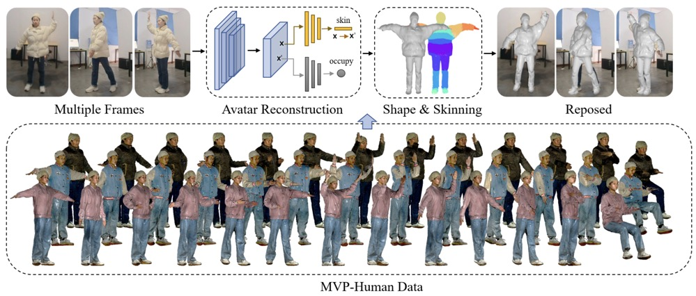
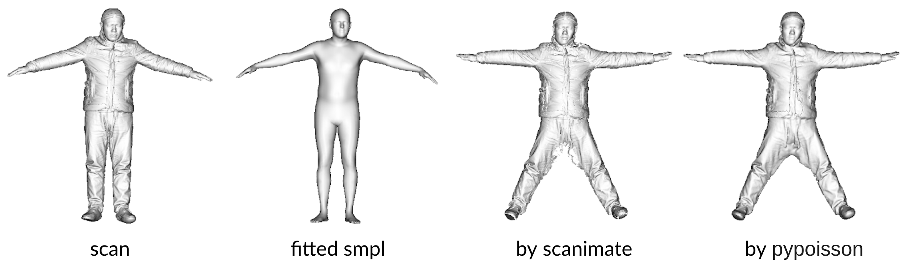

# MVP-Human Dataset for 3D Clothed Human Avatar Reconstruction from Multiple Frames
   
[](https://arxiv.org/pdf/2204.11184v2.pdf)

This repository contains the official PyTorch implementation of:

**MVP-Human Dataset for 3D Clothed Human Avatar Reconstruction from Multiple Frames**   

 

## Installation
Please follow this [instruction](ARWild/README.md). 
## Scan Canonicalization 

 

**0. Download extra data from this [link](https://drive.google.com/file/d/1zoCojdsrrAHRPif2J2b79jNoKphKYgWw/view?usp=sharing).**

​	Put data in the folder `./data/smpl_related/smpl_data`. 
    
**1. Fit SMPL for raw scan.**  
```sh 
$ python -m apps.fit_smpl.py --in_dir ./data_example --out_dir ./data_example  
```
​		This script will create generate results in folder `out_dir/subject_id/smpl`.
 
**2. Run SCANimate.** 
 ```sh
$ python -m apps.run_scanimate --in_dir ./data_example --out_dir ./data_example  
```
​		This script will create generate results in folder `out_dir/subject_id/cano`.
 
  

## Download Dataset
Applicants are request to complete the [form](https://docs.google.com/forms/d/e/1FAIpQLSfN2ISu7B1CaO2QvLI1UMZ4YQL-RWZ01jbYtgSSFYc04VSiow/viewform) and submit it to acquire the data link. We also offer the convenience of a QR code that links directly to the form. 

 
 


 
 
  